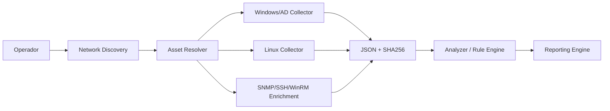

# Cancã — Open Infrastructure Assessment & Intelligence Platform


> **Orizon IT — Produto 01 (P01)**  
> **Cancã — Open Infrastructure Assessment & Intelligence Platform**  
> Plataforma open-source em desenvolvimento para discovery, inventário, análise de configuração, assessment, evidência técnica e inteligência de infraestrutura.

**Cancã** é o nome oficial do produto. O identificador **P01** permanece temporariamente em nomes de arquivos, schemas, headers e artefatos internos durante a fase Technical Alpha para preservar compatibilidade e rastreabilidade dos testes. A migração dos identificadores internos será feita de forma controlada, sem quebrar contratos já validados.

## Product baseline

- [MVP 1.0](docs/MVP.md)
- [Project Governance](docs/PROJECT_GOVERNANCE.md)
- [Architecture](docs/ARCHITECTURE.md)
- [Engineering Roadmap](docs/ROADMAP.md)
- [Source of Truth — GitHub x Google Drive](docs/SOURCE_OF_TRUTH.md)
- [Brand identity](docs/branding/README.md)

## Status de engenharia

- **Windows / AD Collector:** 0.3.0 — candidate, validado em LAB para coleta local/AD, FTP e SMB; teste específico de AD stale ainda precisa de validação com técnica compatível com atributos system-managed.
- **Linux Collector:** 0.3.0 — candidate, validado em LAB em Ubuntu e Rocky para SSH, FTP, Samba, password policy, serviços e plataforma.
- **Analyzer / Rule Engine:** 0.2.0 — candidate, 19 regras determinísticas e rastreabilidade para a evidência de origem.
- **Network Discovery Scanner:** 0.4.1 — LAB VALIDATED para o core não autenticado no cenário atual; produção/cobertura corporativa ainda em expansão, sem credenciais, criado para descoberta por múltiplos ranges antes do deep discovery.
- **Credential Manager:** 0.4b.6 — mantém Secret Provider e matching compatível com v0.4b, acrescentando taxonomy de realm/target/privilege/purpose, evidence gates e lint de placeholders.
- **SSH Credentialed Enrichment:** 0.4b.2.1 — LAB VALIDATED em Ubuntu e Rocky via P01-MGMT01; appliance SSH restrito também classificado corretamente.
- **Context-aware Credential Resolver / Planner:** 0.4b.3.2 — v0.4b.3.1 LAB VALIDATED; candidate passa a consumir Assessment Manifest, distinguir realm declarado/observado e bloquear conflito de contexto.
- **WinRM Credentialed Enrichment:** 0.4b.4.3 — LAB VALIDATED em P01-MGMT01 (local realm), P01-DC01 (domain controller/domain realm) e P01-W11-01 (domain workstation); failure semantics transport/auth também validados em runtime.
- **Multi-target Credentialed Executor:** 0.4b.5 — LAB VALIDATED em dry-run, AUTH-only e FULL nos cinco ativos P01LAB; SHA256 binding, profile-drift guard e shared-credential circuit breaker.
- **Assessment Context & Credential Intake:** 0.4b.6 — LAB VALIDATED; manifest não secreto, intake estruturado, declared/observed realm gating e high-privilege guardrails.
- **Asset Resolver:** 0.4c.0 — LAB VALIDATED; 5 Network Discovery + 5 FULL observations -> 5 logical assets, 0 unresolved, 0 ambiguous, 0 conflicts.
- **Evidence Bundle:** 0.5a.0 — LAB VALIDATED; `.p01bundle` único para connected/offline transport, 8-artifact P01LAB bundle, SHA256 inventory e secret-material guard.
- **Offline Import:** 0.5b.0 — LAB VALIDATED; import idempotente, raw evidence preservation, receipt JSON/SHA256 e server-side Asset Resolver replay com semantic_match=true.
- **Central Ingestion API:** 0.5c.1 — LAB VALIDATED; localhost ingestion, idempotência, status lookup, semantic equivalence, negative gates e connection hygiene.
- **Connected Discovery Node Upload:** 0.5d.0 — LAB VALIDATED; HTTPS/mTLS, identidade do node ligada ao certificado e ao bundle, upload outbound, idempotência e transporte cross-host Windows→Linux validados.
- **Reporting Engine:** planejado após Network Discovery + Asset Resolver.

> Saídas reais de discovery devem ser tratadas como **CONFIDENCIAL — DADOS DO CLIENTE**.

## Arquitetura alvo



O scanner **descobre**. Os collectors **aprofundam**. O Asset Resolver **deduplica**. O Analyzer **interpreta evidências**. O Reporting Engine **apresenta**.

## Estrutura do repositório

```text
.
├── analyzer/
│   ├── P01_Discovery_Analyzer.py
│   ├── P01_Rules.json
│   └── README.md
├── collectors/
│   ├── linux/
│   │   └── P01_Linux_Discovery_Collector.py
│   └── windows/
│       └── P01_Windows_AD_Discovery_Collector.ps1
├── connected/
│   ├── P01_Discovery_Node_Uploader.py
│   └── README.md
├── credentialed_enrichment/
│   ├── P01_SSH_Enricher.py
│   ├── requirements-ssh.txt
│   ├── P01_WinRM_Enricher.py
│   ├── requirements-winrm.txt
│   ├── README-WINRM.md
│   └── README.md
├── asset_resolver/
│   ├── P01_Asset_Resolver.py
│   └── README.md
├── ingestion/
│   ├── P01_Offline_Import.py
│   └── README.md
├── evidence_bundle/
│   ├── P01_Evidence_Bundle.py
│   └── README.md
├── network_discovery/
│   ├── P01_Network_Discovery_Scanner.py
│   ├── targets.example.txt
│   ├── excludes.example.txt
│   └── README.md
├── schemas/
│   ├── p01-discovery-schema-v0.2.json
│   └── p01-discovery-schema-v0.3.json
├── tests/
│   └── test_network_discovery.py
├── docs/
│   ├── ARCHITECTURE.md
│   ├── VALIDATION.md
│   ├── SOURCE_OF_TRUTH.md
│   ├── ROADMAP.md
│   └── validation/
└── .github/workflows/
```

## Uso — Network Discovery v0.4a

A execução requer confirmação explícita de que o operador está autorizado a varrer o escopo.

```powershell
python .\network_discovery\P01_Network_Discovery_Scanner.py `
  --target 192.168.1.0/24 `
  --profile safe `
  --workers 64 `
  --run-label CASA-LAB `
  --output-dir .\output `
  --ack-authorized-scan
```

Múltiplas faixas e exclusões:

```powershell
python .\network_discovery\P01_Network_Discovery_Scanner.py `
  --target 10.10.10.0/24 `
  --target 10.10.20.0/24 `
  --exclude 10.10.10.200-220 `
  --profile safe `
  --ack-authorized-scan
```

A v0.4a **não tenta credenciais**. Credential Manager, SNMP, SSH e WinRM entram na v0.4b.

## Uso — collectors

Windows:

```powershell
powershell.exe -NoProfile -ExecutionPolicy Bypass `
  -File .\collectors\windows\P01_Windows_AD_Discovery_Collector.ps1 `
  -OutputDirectory C:\P01\output `
  -RunLabel LAB-P01 `
  -IncludeIdentityDetails
```

Linux:

```bash
python3 ./collectors/linux/P01_Linux_Discovery_Collector.py \
  --output-dir ./output \
  --run-label LAB-P01
```

## Uso — Analyzer

```bash
python3 ./analyzer/P01_Discovery_Analyzer.py \
  --input-dir ./inputs \
  --output-dir ./output \
  --rules-file ./analyzer/P01_Rules.json \
  --run-label LAB-P01
```

## AD stale

`lastLogonTimestamp` é administrado pelo Active Directory e não deve ser tratado como um campo livremente editável para simulação. A validação do caminho de stale deve usar threshold reduzido em objetos que nunca logaram e testes sintéticos. O threshold operacional padrão permanece 90 dias. Veja [docs/validation/AD_STALE_v0.3.md](docs/validation/AD_STALE_v0.3.md).

## GitHub x Google Drive

O **GitHub é a fonte de verdade de engenharia**: código, testes, schemas, rulesets, documentação técnica, CI, issues e histórico de commits.

O **Google Drive é a fonte de verdade de produto, governança e evidência**: CI do produto, oferta comercial, LAB, resultados brutos, JSON/SHA256 de validação, relatórios, entregáveis e snapshots formais de release.

Não devem existir duas cópias editáveis concorrentes do mesmo código. Veja [docs/SOURCE_OF_TRUTH.md](docs/SOURCE_OF_TRUTH.md).


## Licenciamento e comunidade

Cancã adota a **GNU Affero General Public License v3.0 (AGPLv3)** como licença do projeto open-source.

A estratégia definida pela Orizon IT é construir o Cancã como base tecnológica de um ecossistema comercial sustentado por suporte, assessments, serviços profissionais, integrações, treinamento, serviços gerenciados e, futuramente, SaaS.

Contribuições externas serão regidas por um **Contributor License Agreement (CLA) da Orizon IT**. O texto final do CLA e a política pública de contribuição serão fechados antes do Community Beta.

A marca **Cancã**, a identidade visual e os sinais distintivos da **Orizon IT** não são licenciados automaticamente pela AGPLv3. Uma política de uso de marca será publicada antes da abertura pública do projeto.

## Segurança

- nunca commitar credenciais, tokens, chaves privadas ou outputs reais de clientes;
- network discovery somente em escopo explicitamente autorizado;
- credentialed discovery deve usar Secret Provider e least privilege;
- nenhuma senha deve aparecer em JSON, logs ou rulesets;
- collectors são read-only first;
- network scanning é ativo, mas não deve explorar vulnerabilidades;
- limites de concorrência e scope são guardrails de produto.

## Versionamento

O repositório preserva histórico por **commits, branches, tags e releases**. O código-fonte principal não precisa manter cópias duplicadas por versão. Schemas podem coexistir quando compatibilidade exigir.

## Próximas fases

1. fechar validação AD stale v0.3;
2. validar Network Discovery v0.4a em rede doméstica/autorizada;
3. v0.5e — Portable Discovery Node Runtime & Unified Operator Workflow;
4. v0.5f — Optional Installed Service/Agent reutilizando o mesmo runtime core;
5. v0.4c — evoluir identidade persistente, conflito e adapters adicionais;
5. depois: SNMPv3/SNMPv2c, VMware/network adapters e Dynamic Scope Expansion;
6. Reporting Engine v0.1;
7. depois: CVE correlation, Patch Compliance, File Server Assessment e topologia.

Mais detalhes: [docs/ROADMAP.md](docs/ROADMAP.md).

---

**Cancã — Open Infrastructure Assessment & Intelligence Platform**  
**Orizon IT — Tecnologia que transforma negócios.**
