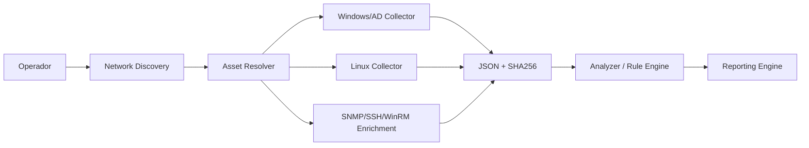

# Orizon IT — P01 Discovery Framework

> **Produto 01 — Infrastructure Assessment**  
> Plataforma em desenvolvimento para discovery, inventário, análise de configuração, assessment e evidência técnica de ambientes de infraestrutura.

## Status de engenharia

- **Windows / AD Collector:** 0.3.0 — candidate, validado em LAB para coleta local/AD, FTP e SMB; teste específico de AD stale ainda precisa de validação com técnica compatível com atributos system-managed.
- **Linux Collector:** 0.3.0 — candidate, validado em LAB em Ubuntu e Rocky para SSH, FTP, Samba, password policy, serviços e plataforma.
- **Analyzer / Rule Engine:** 0.2.0 — candidate, 19 regras determinísticas e rastreabilidade para a evidência de origem.
- **Network Discovery Scanner:** 0.4.1 — LAB VALIDATED para o core não autenticado no cenário atual; produção/cobertura corporativa ainda em expansão, sem credenciais, criado para descoberta por múltiplos ranges antes do deep discovery.
- **Credential Manager:** 0.4b.1 — foundation candidate para perfis, seleção por escopo/protocolo e referências seguras.\n- **Reporting Engine:** planejado após Network Discovery + Asset Resolver.

> Saídas reais de discovery devem ser tratadas como **CONFIDENCIAL — DADOS DO CLIENTE**.

## Arquitetura alvo



O scanner **descobre**. Os collectors **aprofundam**. O Asset Resolver **deduplica**. O Analyzer **interpreta evidências**. O Reporting Engine **apresenta**.

## Estrutura do repositório

```text
.
├── analyzer/
│   ├── P01_Discovery_Analyzer.py
│   ├── P01_Rules.json
│   └── README.md
├── collectors/
│   ├── linux/
│   │   └── P01_Linux_Discovery_Collector.py
│   └── windows/
│       └── P01_Windows_AD_Discovery_Collector.ps1
├── network_discovery/
│   ├── P01_Network_Discovery_Scanner.py
│   ├── targets.example.txt
│   ├── excludes.example.txt
│   └── README.md
├── schemas/
│   ├── p01-discovery-schema-v0.2.json
│   └── p01-discovery-schema-v0.3.json
├── tests/
│   └── test_network_discovery.py
├── docs/
│   ├── ARCHITECTURE.md
│   ├── VALIDATION.md
│   ├── SOURCE_OF_TRUTH.md
│   ├── ROADMAP.md
│   └── validation/
└── .github/workflows/
```

## Uso — Network Discovery v0.4a

A execução requer confirmação explícita de que o operador está autorizado a varrer o escopo.

```powershell
python .\network_discovery\P01_Network_Discovery_Scanner.py `
  --target 192.168.1.0/24 `
  --profile safe `
  --workers 64 `
  --run-label CASA-LAB `
  --output-dir .\output `
  --ack-authorized-scan
```

Múltiplas faixas e exclusões:

```powershell
python .\network_discovery\P01_Network_Discovery_Scanner.py `
  --target 10.10.10.0/24 `
  --target 10.10.20.0/24 `
  --exclude 10.10.10.200-220 `
  --profile safe `
  --ack-authorized-scan
```

A v0.4a **não tenta credenciais**. Credential Manager, SNMP, SSH e WinRM entram na v0.4b.

## Uso — collectors

Windows:

```powershell
powershell.exe -NoProfile -ExecutionPolicy Bypass `
  -File .\collectors\windows\P01_Windows_AD_Discovery_Collector.ps1 `
  -OutputDirectory C:\P01\output `
  -RunLabel LAB-P01 `
  -IncludeIdentityDetails
```

Linux:

```bash
python3 ./collectors/linux/P01_Linux_Discovery_Collector.py \
  --output-dir ./output \
  --run-label LAB-P01
```

## Uso — Analyzer

```bash
python3 ./analyzer/P01_Discovery_Analyzer.py \
  --input-dir ./inputs \
  --output-dir ./output \
  --rules-file ./analyzer/P01_Rules.json \
  --run-label LAB-P01
```

## AD stale

`lastLogonTimestamp` é administrado pelo Active Directory e não deve ser tratado como um campo livremente editável para simulação. A validação do caminho de stale deve usar threshold reduzido em objetos que nunca logaram e testes sintéticos. O threshold operacional padrão permanece 90 dias. Veja [docs/validation/AD_STALE_v0.3.md](docs/validation/AD_STALE_v0.3.md).

## GitHub x Google Drive

O **GitHub é a fonte de verdade de engenharia**: código, testes, schemas, rulesets, documentação técnica, CI, issues e histórico de commits.

O **Google Drive é a fonte de verdade de produto, governança e evidência**: CI do produto, oferta comercial, LAB, resultados brutos, JSON/SHA256 de validação, relatórios, entregáveis e snapshots formais de release.

Não devem existir duas cópias editáveis concorrentes do mesmo código. Veja [docs/SOURCE_OF_TRUTH.md](docs/SOURCE_OF_TRUTH.md).

## Segurança

- nunca commitar credenciais, tokens, chaves privadas ou outputs reais de clientes;
- network discovery somente em escopo explicitamente autorizado;
- credentialed discovery deve usar Secret Provider e least privilege;
- nenhuma senha deve aparecer em JSON, logs ou rulesets;
- collectors são read-only first;
- network scanning é ativo, mas não deve explorar vulnerabilidades;
- limites de concorrência e scope são guardrails de produto.

## Versionamento

O repositório preserva histórico por **commits, branches, tags e releases**. O código-fonte principal não precisa manter cópias duplicadas por versão. Schemas podem coexistir quando compatibilidade exigir.

## Próximas fases

1. fechar validação AD stale v0.3;
2. validar Network Discovery v0.4a em rede doméstica/autorizada;
3. v0.4b — Credential Manager + SNMP/SSH/WinRM;
4. v0.4c — Asset Resolver e deduplicação;
5. Reporting Engine v0.1;
6. depois: CVE correlation, Patch Compliance, File Server Assessment e topologia.

Mais detalhes: [docs/ROADMAP.md](docs/ROADMAP.md).

---

**Orizon IT — Tecnologia que transforma negócios.**
