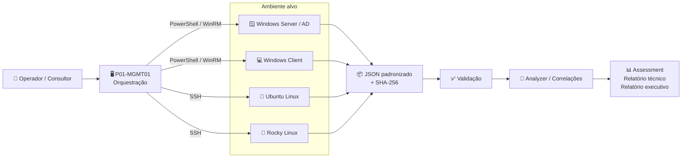
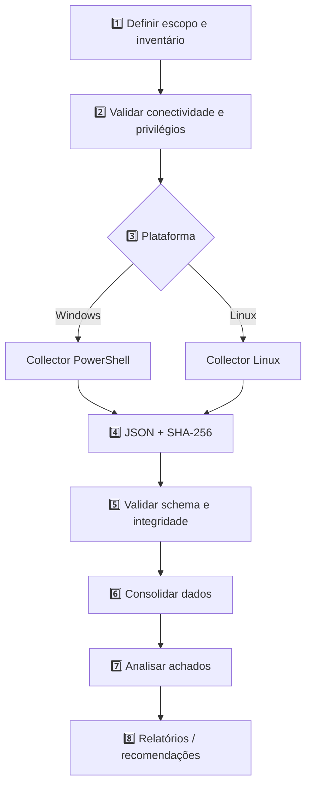

# Orizon IT — P01 Discovery Framework

> **Produto 01 — Infrastructure Discovery & Assessment**  
> Framework de discovery técnico, inventário e assessment para ambientes Windows, Active Directory e Linux.

O **P01 Discovery Framework** é a base técnica do Produto 01 da Orizon IT. A solução foi desenhada para coletar informações de infraestrutura de forma padronizada, rastreável e preferencialmente *read-only*, transformando dados técnicos dispersos em uma estrutura consistente para **inventário, diagnóstico, assessment, documentação, planejamento de modernização e geração de relatórios**.

> **Status atual:** laboratório / validação técnica.  
> **Classificação recomendada das saídas:** CONFIDENCIAL — DADOS DO CLIENTE.

---

## 1. O problema que o projeto resolve

Assessments de infraestrutura costumam começar com coleta manual, planilhas, comandos executados host a host e evidências em formatos diferentes. Isso aumenta o esforço, dificulta comparações e torna a documentação dependente de trabalho repetitivo.

O P01 busca padronizar esse processo:

- identificar o ambiente;
- executar collectors adequados à plataforma;
- coletar dados técnicos de forma estruturada;
- registrar erros, limitações e avisos sem ocultá-los;
- gerar evidência de integridade com SHA-256;
- consolidar os resultados para análise posterior;
- servir de base para relatórios técnicos e executivos.

---

## 2. Visão da solução



### Princípio central

O collector **coleta e descreve**. A camada de análise **interpreta e correlaciona**. A camada de relatório **transforma os achados em informação útil para decisão**.

Essa separação evita que o collector tenha regras de negócio excessivas e facilita evolução, testes e suporte a novas plataformas.

---

## 3. Fluxo operacional



---

## 4. Arquitetura lógica

| Camada | Responsabilidade | Tecnologias previstas |
|---|---|---|
| **Orquestração** | Inventário, distribuição e execução remota | PowerShell, SSH, WinRM |
| **Collectors** | Coleta local e normalização inicial | PowerShell 5.1+, Python/Bash |
| **Schema** | Contrato de dados entre coleta e análise | JSON Schema |
| **Integridade** | Evidência de que a saída não foi alterada | SHA-256 |
| **Analyzer** | Correlações e regras de assessment | Evolução do Produto 01 |
| **Reporting** | Entregáveis técnicos e executivos | Evolução do Produto 01 |

Mais detalhes em [docs/ARCHITECTURE.md](docs/ARCHITECTURE.md).

---

## 5. Laboratório de referência

A validação inicial usa uma rede isolada:

```text
192.168.100.0/24
```

| Host | Função | Endereço de referência |
|---|---|---:|
| P01-DC01 | Windows Server / Active Directory | 192.168.100.10 |
| P01-W11-01 | Windows Client | 192.168.100.20 |
| P01-MGMT01 | Management / Orchestrator | 192.168.100.30 |
| P01-LNX-UBU01 | Ubuntu Linux | 192.168.100.40 |
| P01-LNX-RKY01 | Rocky Linux | 192.168.100.50 |

> Esses endereços pertencem exclusivamente ao laboratório e não representam parâmetros obrigatórios do produto.

---

## 6. Estrutura do repositório

```text
.
├── .github/
│   ├── workflows/
│   ├── ISSUE_TEMPLATE/
│   └── PULL_REQUEST_TEMPLATE.md
├── collectors/
│   ├── windows/
│   └── linux/
├── docs/
│   ├── ARCHITECTURE.md
│   ├── INSTALLATION.md
│   ├── SECURITY.md
│   ├── TROUBLESHOOTING.md
│   └── VALIDATION.md
├── orchestrator/
│   ├── inventory/
│   └── README.md
├── schemas/
├── samples/
├── CHANGELOG.md
├── CONTRIBUTING.md
├── LICENSE
├── SECURITY.md
└── README.md
```

---

## 7. Collector Windows / Active Directory

O collector Windows atual foi desenvolvido para **Windows PowerShell 5.1+** e executa coleta local com suporte opcional a Active Directory e GPO.

### Principais blocos de coleta

- sistema operacional;
- fabricante/modelo e recursos de hardware;
- BIOS;
- processadores;
- volumes;
- hotfixes;
- adaptadores, IP, rotas e DNS;
- perfis de firewall;
- Microsoft Defender, quando disponível;
- RDP;
- administradores locais;
- serviços;
- tarefas agendadas;
- roles/features;
- Active Directory, quando RSAT/módulos estiverem disponíveis;
- GPO, quando o módulo GroupPolicy estiver disponível;
- erros, limitações e avisos da execução.

### Execução

```powershell
Set-ExecutionPolicy -Scope Process -ExecutionPolicy Bypass -Force

Unblock-File .\collectors\windows\P01_Windows_AD_Discovery_Collector_v0.2.1.ps1

.\collectors\windows\P01_Windows_AD_Discovery_Collector_v0.2.1.ps1 `
    -OutputDirectory "C:\P01\Output" `
    -RunLabel "LAB-P01"
```

Saída esperada:

```text
P01-Windows-AD-Discovery-Collector_HOST_TIMESTAMP_LABEL.json
P01-Windows-AD-Discovery-Collector_HOST_TIMESTAMP_LABEL.json.sha256
```

---

## 8. Segurança e privacidade

O projeto deve seguir algumas regras desde o laboratório:

- **não armazenar senhas, tokens, chaves privadas ou segredos no repositório**;
- não fazer commit de outputs reais de clientes;
- tratar arquivos de discovery como informação confidencial;
- preferir contas técnicas dedicadas;
- aplicar princípio de menor privilégio em produção;
- evitar `NOPASSWD: ALL` fora de laboratório;
- collectors devem ser *read-only* sempre que possível;
- registrar explicitamente limitações de privilégio em vez de tentar contorná-las silenciosamente;
- usar SHA-256 para rastreabilidade da evidência coletada.

Consulte [SECURITY.md](SECURITY.md) e [docs/SECURITY.md](docs/SECURITY.md).

---

## 9. Versionamento

O projeto adota **Semantic Versioning** sempre que aplicável:

```text
MAJOR.MINOR.PATCH
```

Exemplos:

- `0.2.0` — evolução funcional durante validação;
- `0.2.1` — correção compatível;
- `1.0.0` — primeira versão considerada estável para uso definido.

Mudanças relevantes devem ser registradas no [CHANGELOG.md](CHANGELOG.md).

---

## 10. Roadmap

### Fase 1 — Discovery / laboratório
- [x] estrutura base do projeto;
- [x] collector Windows / AD;
- [x] JSON + SHA-256;
- [x] tratamento de errors / limitations / warnings;
- [ ] collector Linux validado;
- [ ] schema comum validado;
- [ ] matriz formal de testes.

### Fase 2 — Orquestração
- [ ] inventário central de hosts;
- [ ] execução remota Windows;
- [ ] execução remota Linux;
- [ ] coleta automática dos resultados;
- [ ] logging central;
- [ ] execução concorrente controlada.

### Fase 3 — Analyzer
- [ ] normalização multi-host;
- [ ] correlações;
- [ ] scoring técnico baseado em critérios documentados;
- [ ] identificação de riscos e dependências;
- [ ] evidências rastreáveis por achado.

### Fase 4 — Reporting
- [ ] relatório técnico;
- [ ] resumo executivo;
- [ ] dashboard;
- [ ] recomendações priorizadas;
- [ ] exportação de evidências.

---

## 11. Princípios de engenharia

1. **Read-only first** — coletar antes de alterar.
2. **Falha explícita** — erro não deve desaparecer silenciosamente.
3. **Portabilidade** — reduzir dependências desnecessárias.
4. **Compatibilidade documentada** — especialmente Windows PowerShell 5.1.
5. **Dados estruturados** — saída legível por máquina e por humano.
6. **Separação de responsabilidades** — coleta, análise e relatório são camadas distintas.
7. **Segurança desde o desenho** — nenhum segredo no código.
8. **Reprodutibilidade** — execução e resultado devem poder ser validados.
9. **Documentação como parte do produto** — não como etapa posterior.
10. **Evolução orientada por testes de laboratório**.

---

## 12. Contribuição

Antes de alterar collectors, schema ou arquitetura, consulte [CONTRIBUTING.md](CONTRIBUTING.md).

Fluxo recomendado:

```text
issue → branch feature/fix → testes → pull request → revisão → main
```

---

## 13. Licença

Este é um projeto proprietário da **Orizon IT**. Consulte [LICENSE](LICENSE).

---

## Orizon IT

**Tecnologia que transforma negócios.**

O P01 Discovery Framework faz parte da construção do portfólio técnico da Orizon IT e está em evolução contínua.
