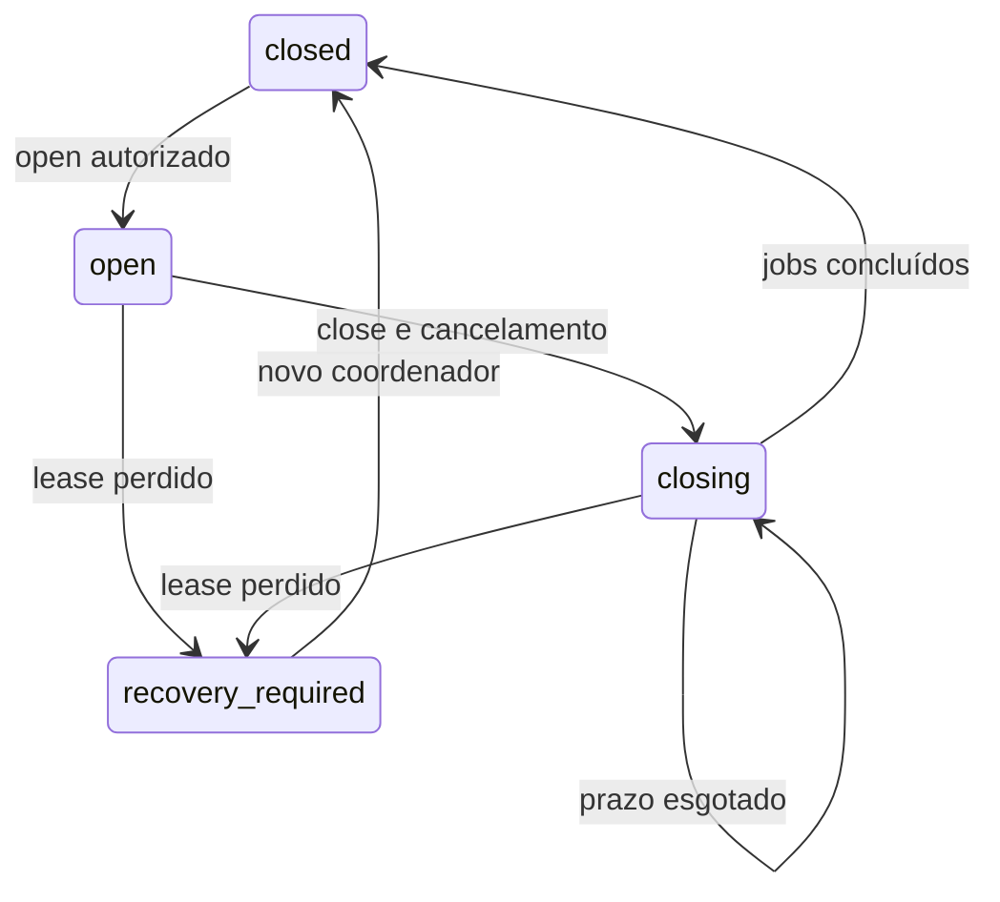

# ADR 0038 — Coordenador de workspace v0.6.22

Data: 07/10/2026. Status: aceito para implementação CANDIDATE opt-in.
[ADR 0036](ADR_0036_Workspace_First_1.0.md) · [Fundação](ADR_0037_Workspace_Foundation_v0.6.21.md).

## Decisão

Uma instalação do servidor corresponde a um banco PostgreSQL. Ela tem um único
coordenador com conexão física dedicada e um advisory lock de sessão, não
reentrante pela API. O lock vale entre processos/hosts conectados ao mesmo banco;
fechar somente o workspace mantém o coordenador e o lock. Encerrar a conexão ou
processo libera o lock. Não usar pool em modo transação, read replica ou bancos
independentes para os workers de uma instalação.

Migração 0006 é opt-in separada. A linha singleton contém role do coordenador,
generation monotônica, estado, workspace ativo e lease ID aleatório. RLS forçada
permite SELECT/UPDATE apenas à role provisionada. Roles de conteúdo não recebem
esses privileges. A role do coordenador é NOSUPERUSER/NOBYPASSRLS, sem ownership,
DDL, memberships de operador ou privileges em conteúdo. Ela é uma identidade de
serviço confiável; SQL/policies não protegem contra controle dessa identidade ou
manutenção privilegiada. Provisionamento administrativo é idempotente e não
reassocia a role. Banco novo de outra instalação terá outro coordenador.

## Ciclo e cercas

Start adquire o lock e incrementa generation; qualquer estado persistido anterior
é substituído por closed. Não retoma job, scan, credencial, upload ou cache.
Open exige grant read da conexão do ator e generation esperada; usa somente ID
validado, sem materializar inventário. Outra base é busy. Mesma base/revisão tem
replay. Close exige grant write, bloqueia novas admissões, incrementa generation,
sinaliza cancelamento e aguarda jobs registrados. Depois libera o cache, persiste
closed e permite open explícito. Close concorrente não pode fechar outra geração.

Timeout deixa closing com o lock retido: há retry explícito com a generation
atual, sem abertura automática. Shutdown confiável drena antes de liberar a
conexão; timeout também retém o lease. Process exit libera a sessão no banco;
novo start incrementa generation e não aceita tokens do processo anterior.

Heartbeat verifica sessão/lock/lease/generation; default um segundo, configurável
entre 0,05 e 30. Falha invalida o contexto local, sinaliza cancelamento e limpa o
cache. Não há TTL que autorize tomar a posse de uma sessão ainda viva. A
liberação depende de PostgreSQL detectar o fim da sessão; partição pode conservar
busy até o timeout/keepalive do transporte. O serviço não reconecta ou retoma
trabalho automaticamente.

Jobs têm Token(workspace ID, generation, lease ID) e autorização revalidada em
cada check/acesso ao cache. Cache aceita bytes imutáveis e tem limites de entradas,
bytes e tamanho por entrada. É um cache interno do workspace, não uma API de
conteúdo ou uma substituição dos grants exatos de assessment. Nenhum job é
criado pelo coordenador: só registra contextos de trabalho explícitos.

## Limites de integração

Esta entrega implementa a fundação programática e seus contratos, sem endpoint,
UI/multiaba de navegador, inventory loader, import commit ou ligação ao scanner,
exportador e caches legados. Opening fica reservado ao futuro loader; open
atual ativa apenas o contexto lógico. R02 é parcial até essas ligações.

Cancelamento é cooperativo. Código já executando fora do coordenador pode reter
referências privadas até retornar; lease perdido não termina threads à força.
Operation.check é necessário antes de publicar resultado; commits futuros
exigem fence atômico na mesma transação do adapter. Não há garantia de desfazer
bytes já entregues ou de tornar um callback arbitrário seguro. Os adapters terão
seus próprios testes de autorização/revisão/commit. Falha ou trabalho que não
drena mantém o contexto bloqueado até shutdown/recovery explícito.

Prova sintética de 20 trocas confirma contadores/cache liberados, não capacidade
comercial, RAM de grafo ou latência p95. T03/T14 completos dependem de integrações,
browser, benchmarks e LAB posteriores. [Guia](WORKSPACE_COORDINATOR_v0.6.22.md).
