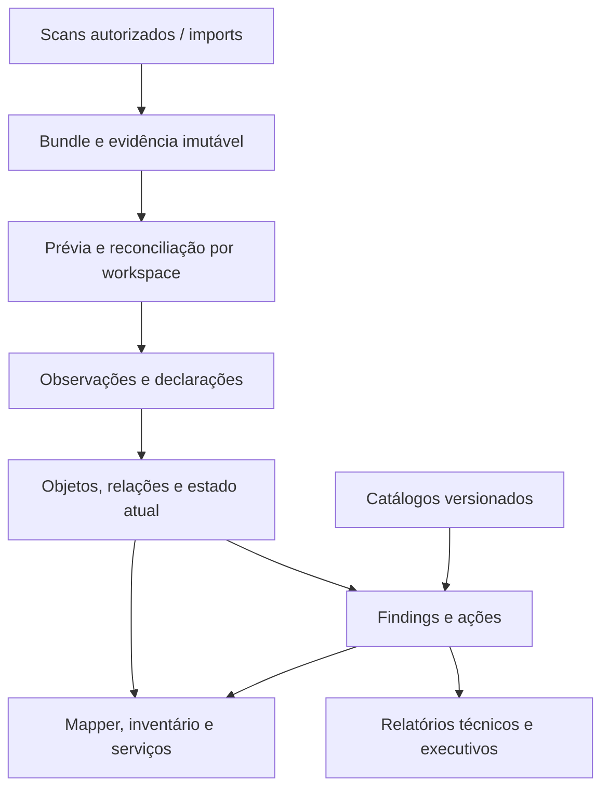

# Cancã — desenho da solução 1.0

Rebaseline 06/10/2026 (-03). [Especificação](PRODUCT_SPEC_1.0.md) ·
[ADR 0036](ADR_0036_Workspace_First_1.0.md) · [Migração](IMPLEMENTATION_PLAN_1.0.md).
Desenho alvo; não declara implementação das funcionalidades novas.

## Base preservada e evolução

Existem descoberta autorizada, SSH/WinRM, SNMP essencial CANDIDATE, resolver,
bundle JSON/SHA256, replay offline, upload outbound mTLS, portable, PostgreSQL,
lifecycle/identidade/findings históricos e reports. API/Web mínima usa assessments.
A extensão coloca workspace acima das avaliações e projeta observações em objetos,
relações e estado atual. Assessment é avaliação; CollectionRun é coleta;
ImportPlan é decisão de aplicação. Não são entidades intercambiáveis.

## Controle e dados

| Plano | Responsabilidade |
|---|---|
| Controle do servidor | Registro leve de bases, contas/grants, lease de carga única, config/manutenção e catálogos públicos. |
| Dados de workspace | Sites/ambientes, objetos/imports/observações/relações/mapas/serviços/findings/ações/evidência/catálogos privados. |
| Coleta | Node/standalone lê alvos autorizados, resolve secrets localmente e gera bundle; descoberta não autoriza novos scopes. |
| Apresentação | API autorizada entrega páginas/subgrafos/snapshots; UI não decide isolamento. |

Administração não é workspace universal. Catálogo público read-only compartilhado;
overrides/Graph/secrets de cliente pertencem somente à base correspondente.

## Entidades alvo

| Entidade | Ownership e vínculo |
|---|---|
| Workspace | ID/nome/organization metadata/revisão/lifecycle de carga/grants. |
| Environment | workspace_id, finalidade lógica opcional de objetos/runs. |
| Site | workspace_id, tipo físico/cloud/remoto, hierarquia interna. |
| Assessment | workspace_id, avaliação/lifecycle histórico existente. |
| CollectionRun | workspace_id, node/run/autorização/horários/categoria/cobertura/fontes. |
| ImportPlan / Receipt | workspace_id, pacote/hash/seleção/política/revisão/decisões. |
| Asset / AssetIdentity | workspace_id, identidade estável/sinais qualificados/origem/confiança; IP contextual. |
| Interface / Component | workspace_id + asset_id, porta/NIC/SFP/disco e índices de origem. |
| Network / VLAN | workspace_id + namespace de site/VRF/fabric; VLAN 10 não é identidade universal. |
| Observation | workspace_id, run/import/source/hash/atributo/valor/timestamp/cobertura imutáveis. |
| Declaration | workspace_id, atributo/relação manual, autor/motivo/revisões. |
| Relationship | workspace_id, source/target/component, tipo/direção/origem/validade/confiança/evidência. |
| Service | workspace_id, dependências/grupos/redundância declarados. |
| Map / Submap | workspace_id, projeção/camada/grupo/layout/referências, sem duplicar assets. |
| Finding / Action | workspace_id, ocorrência histórica/recomendação/responsável/horizonte/estado. |
| CatalogSnapshot | Público ou workspace privado; fonte/versão/hash/licença/validade/normalização. |

Tipos iniciais: `connected_to`, `hosted_on`, `member_of`, `depends_on`,
`available_on`, `located_in`. Interface conhecida identifica conexão; porta
não conhecida mantém limitação. Ciclos físicos permitidos; dependências têm
visitas/limites para evitar loops. Hierarquia site/submap não admite ciclos.
Nenhuma referência liga bases distintas.

## Isolamento e carga

Chaves/FKs compostas `(workspace_id, object_id)` protegem ownership e as duas
pontas de Relationship. IDs externos podem repetir em bases distintas.
Contexto/grant exigidos antes de SQL/store/secret/tarefa. RLS com roles sem bypass,
contexto transacional e limpeza no pool; migrator/owner separados de reader/writer.
RLS nova habilitada após backfill/grants qualificados. Testar SQL direto e IDs
válidos da outra base, não só IDs inexistentes.

Store particionado usa paths derivados de IDs validados, não nomes do usuário.
Legado permanece read-only com mapping explícito; sem traversal/symlink/extractall.
Canonical importer verifica hash/replay antes da projeção.

Fundação programática: [coordenador v0.6.22](WORKSPACE_COORDINATOR_v0.6.22.md),
opt-in, ainda sem Web/loader/jobs legados. Lease/generation da instalação impede duas bases ativas e cerca tasks/cache/cursor/
respostas/downloads. Caches incluem workspace/revisão e são liberados no close.
Troca bloqueia admissão, conclui/cancela tasks, reconcilia commit e fecha antes de
abrir a próxima base. Lease não dá grant de leitura. Reinício não repete rede.

## Reconciliação e temporalidade

Identidade persiste entre runs da base com referência ao assessment/asset legado.
Sinais fortes/corroborados; IP/nome/modelo isolados não autorizam merge. Ambíguos
em revisão. Link/unlink manual versionado não reescreve observações.

Prévia pinada por revisão da base/hashes/política/categorias. Commit verifica os
mesmos bindings; drift exige nova prévia. Dedup por bundle/hash/seleção/política
na base evita reaplicação. Hash não autentica origem: Node/operador continua separado.

Estado atual é projeção versionada por atributo/cobertura/precedência de origem.
Tempo do dispositivo não confiável é marcado. Import antigo fica na história sem
regressão silenciosa. Ausência em scan parcial envelhece o dado, sem apagá-lo ou
fechar finding automaticamente. Declarado e observado conflitantes ficam visíveis.

Export seletivo inclui dependências necessárias ou stubs tipados sem atributos não
selecionados; manifest e prévia mostram seleção/cobertura/stubs. Categoria parcial
não altera outras. Evidência-only não modifica estado atual.

## Inteligência, UI e backup

Rule engine puro consome snapshots/cobertura/catálogos pinados. Findings guardam
regra/versão/hashes/fontes/confiança/limitações e ações. Inferência L2 é hipótese;
impacto de serviço é potencial. Não habilitar polling automaticamente.

Mapper consulta subgrafos limitados/paginados com workspace/revisão; zoom altera
nível/camada, não carrega inventário inteiro. Layout não modifica grafo observado;
link manual cria Declaration. Cancelamento/generation suprime respostas tardias.

Backup coordenado captura banco/store/catálogos/config em revisão consistente e
manifest/hashes/roles. Restore validado em destino isolado antes da publicação;
colisão de workspace ID exige decisão explícita. Não retomar tasks/secrets/grants
sem revisão. [Plano de teste](TEST_PLAN_1.0.md).

## Incremento backend23–25 (07/10/2026)

[Workspace Model](WORKSPACE_MODEL_v0.6.25.md) e
[ADR0039](ADR_0039_Workspace_Model_v0.6.25.md) fixam histórico append-only,
observado/declarado, grafo manual limitado, revisão transacional e preview/apply
idempotente. O adapter registra operações como jobs e revalida respostas.
Categoria observada identity; sem backfill completo, API humana, UI/Mapper ou
ações em dispositivos. Gates adicionais: drift/replay, sessão perdida/rollback,
close durante commit/preparação, autoria/RLS/FKs A/B e isolamento de sources.
R03–R05 continuam parciais; R06 depende de migração/restore/API e regressão.
