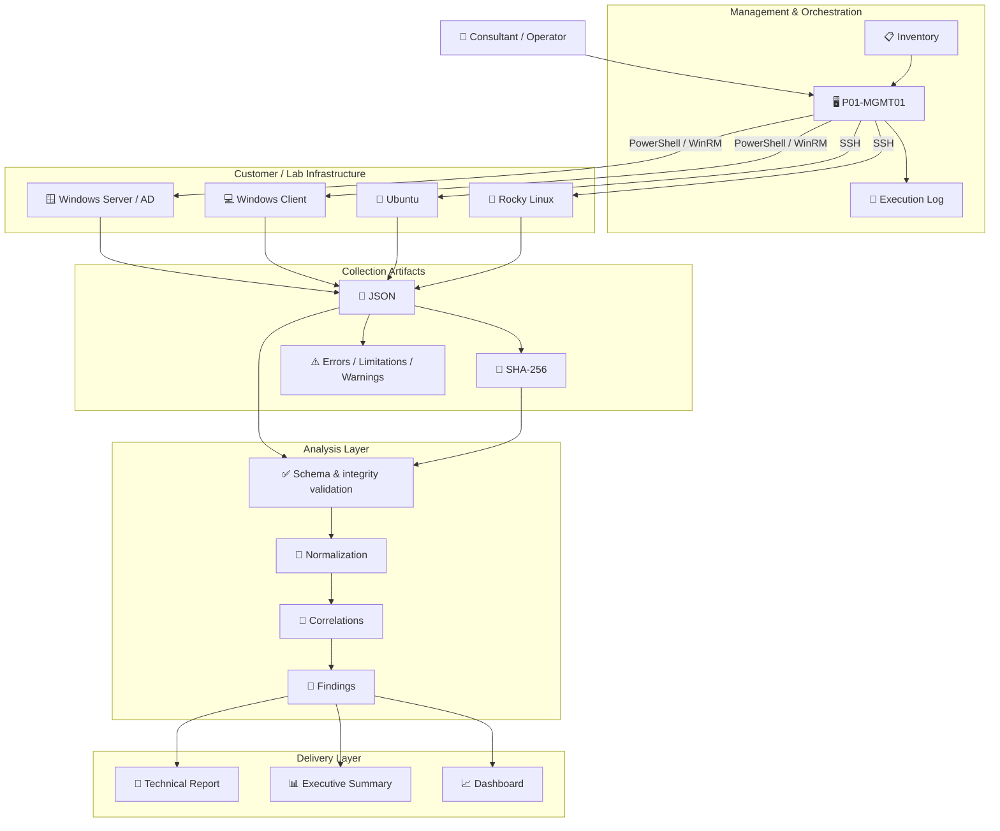
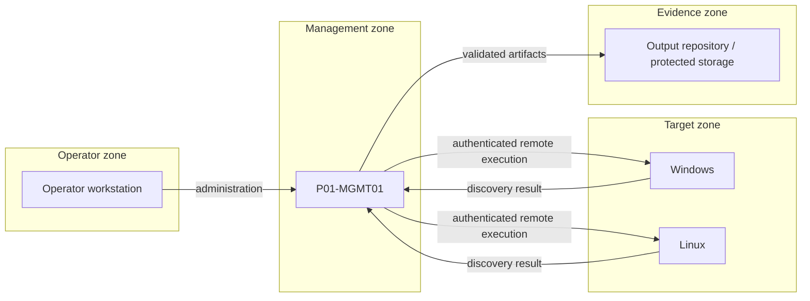
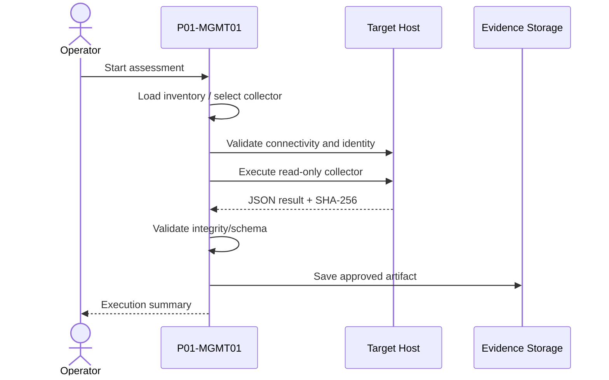

# Architecture

## 1. Purpose

The P01 Discovery Framework separates infrastructure assessment into four
logical concerns:

1. **orchestration** — where and how collectors run;
2. **collection** — platform-specific inventory;
3. **normalization and validation** — consistent machine-readable data;
4. **analysis and reporting** — findings, correlations and deliverables.

This separation allows collectors to stay small, auditable and reusable.

---

## 2. High-level architecture



---

## 3. Trust boundaries



Each boundary must be considered separately for authentication, authorization,
network exposure, logging and data retention.

---

## 4. Collection contract

A collector should return:

```text
metadata
data
errors
limitations
warnings
```

The exact platform data can differ, but common metadata and error semantics
should remain predictable.

### Errors

A collection section could not complete as intended.

### Limitations

The collector completed, but visibility was reduced by privilege, platform,
module availability or another known constraint.

### Warnings

The collector completed but detected a condition worth surfacing.

---

## 5. Remote execution model

The target state is central orchestration:



---

## 6. Design decisions

- **JSON** is the primary interchange format.
- **SHA-256** provides artifact integrity evidence.
- Collectors must not require database access.
- Collectors should remain independently executable.
- Analyzer/reporting logic must not be embedded in collectors unless the logic
  is truly platform collection logic.
- Client-specific data must not be hard-coded into collectors.

---

## 7. Future architecture

Planned evolution includes:

- concurrent remote execution with throttling;
- encrypted credential handling;
- schema validation in CI and at runtime;
- persistent assessment datastore;
- rule engine for findings;
- evidence-to-finding traceability;
- dashboard and report generation;
- signed release artifacts.
