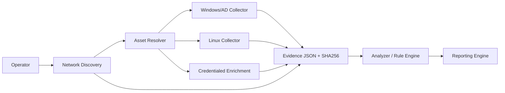
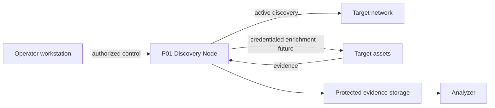

# Architecture

## Purpose

P01 separates discovery, collection, identity resolution, analysis and reporting so each component can evolve and be tested independently.

## High-level architecture



## Responsibilities

### Network Discovery
Find candidate assets in authorized IPv4 scopes using active but non-exploitative probes. v0.4a is non-credentialed.

### Asset Resolver
Future v0.4c component that correlates IP, MAC, hostname, AD object, collector identity, serial/UUID and later SNMP identifiers to avoid duplicate assets.

### Deep Collectors
Platform-specific read-only collectors for Windows/AD and Linux.

### Credentialed Enrichment
v0.4b uses credential profiles and secret references. v0.4b.1 provides the Credential Manager foundation; v0.4b.2 adds SSH password authentication with bounded attempts, explicit TOFU/strict host-key policy and a fixed read-only command allowlist. SNMP and WinRM/WMI follow in later increments. Secrets must never be placed in source, JSON output or logs. Networks learned through authenticated interfaces/routes are emitted only as candidate evidence; recursive scanning remains disabled until the authorized Dynamic Scope Expansion stage.


### Context-aware Credential Resolution
Credential matching is not password propagation. A credential profile becomes eligible only after protocol/scope gates and may be further constrained by discovery context such as service, OS family, device type, vendor/hostname and authentication realm. More-specific profiles win. Shared/domain credentials require a job-level failure budget/circuit breaker to reduce lockout risk.

Examples:
- SSH + Linux fingerprint + lab subnet -> Linux SSH profile;
- WinRM/WMI + Windows + P01LAB domain -> domain discovery profile;
- WinRM/WMI + exact /32 + local realm -> host-specific local Windows profile;
- SNMP + network-device fingerprint -> SNMP profile;
- unknown device -> no credential unless an explicit profile allows unknown targets.

### Discovery Nodes
For multi-segment environments, the preferred architecture is a Discovery Node/Sensor placed where it has legitimate network reachability. The node scans its authorized reachable ranges and uses local secret providers. Results are later consolidated centrally. Devices discovered by the node are not silently converted into jump hosts/pivots.

A dual-homed management server is therefore a valid LAB topology: P01-MGMT01 can act as the discovery origin for its directly reachable NAT/internal networks without exposing the personal workstation to the internal lab routing domain.

### Analyzer
Deterministic rules consume normalized evidence and produce traceable findings. Analyzer logic stays outside collectors.

### Dynamic Scope Expansion
Future v0.4d layer that consumes credentialed topology evidence (interfaces, routes, VLANs and neighbors) and creates candidate networks. New networks are scanned only when they match explicit authorization policy and guardrails. Discovered hosts are not used as automatic pivots.

### Reporting
Future layer for technical/executive reporting and dashboards after asset deduplication is stable.

## Trust boundaries



Network discovery is **active probing**, even when read-only. Authorization and scope are therefore part of the security boundary.

## Collection contract

Deep collectors return:

```text
metadata
data
errors
limitations
warnings
```

Network Discovery returns:

```text
metadata
scope
local_context
summary
assets
errors
limitations
warnings
```

## Design decisions

- JSON is the primary interchange format.
- SHA-256 provides artifact integrity evidence.
- Collectors remain independently executable.
- Analyzer/reporting logic is not embedded in collectors.
- Network scan scope is explicit and guarded.
- v0.4a does not authenticate to discovered devices.
- Credentials will be resolved by profile/scope/protocol, not sprayed across every discovered host.
- GitHub is the engineering source of truth; Drive stores product governance and evidence.
- Real customer outputs never belong in Git.

## Evolution

- v0.4a: non-credentialed Network Discovery.
- v0.4b: Credential Manager + SNMP/SSH/WinRM enrichment.
- v0.4c: Asset Resolver.
- v0.4d: topology-driven Dynamic Scope Expansion with authorization boundaries.
- Reporting Engine after asset identity and discovery scope are reliable.
- Later: CVE intelligence, patch compliance, file-server assessment, topology and vendor plugins.
