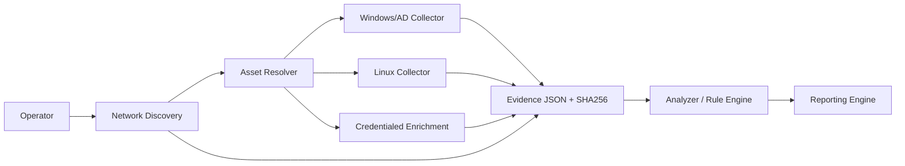
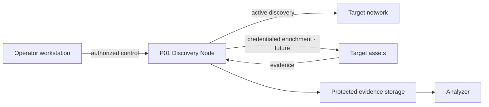

# Architecture

## Purpose

P01 separates discovery, collection, identity resolution, analysis and reporting so each component can evolve and be tested independently.

## High-level architecture



## Responsibilities

### Network Discovery
Find candidate assets in authorized IPv4 scopes using active but non-exploitative probes. v0.4a is non-credentialed.

### Asset Resolver
Future v0.4c component that correlates IP, MAC, hostname, AD object, collector identity, serial/UUID and later SNMP identifiers to avoid duplicate assets.

### Deep Collectors
Platform-specific read-only collectors for Windows/AD and Linux.

### Credentialed Enrichment
Future v0.4b layer for SNMP, SSH and WinRM/WMI using credential profiles and secret references. Secrets must never be placed in source, JSON output or logs.

### Analyzer
Deterministic rules consume normalized evidence and produce traceable findings. Analyzer logic stays outside collectors.

### Reporting
Future layer for technical/executive reporting and dashboards after asset deduplication is stable.

## Trust boundaries



Network discovery is **active probing**, even when read-only. Authorization and scope are therefore part of the security boundary.

## Collection contract

Deep collectors return:

```text
metadata
data
errors
limitations
warnings
```

Network Discovery returns:

```text
metadata
scope
local_context
summary
assets
errors
limitations
warnings
```

## Design decisions

- JSON is the primary interchange format.
- SHA-256 provides artifact integrity evidence.
- Collectors remain independently executable.
- Analyzer/reporting logic is not embedded in collectors.
- Network scan scope is explicit and guarded.
- v0.4a does not authenticate to discovered devices.
- Credentials will be resolved by profile/scope/protocol, not sprayed across every discovered host.
- GitHub is the engineering source of truth; Drive stores product governance and evidence.
- Real customer outputs never belong in Git.

## Evolution

- v0.4a: non-credentialed Network Discovery.
- v0.4b: Credential Manager + SNMP/SSH/WinRM enrichment.
- v0.4c: Asset Resolver.
- Reporting Engine after asset identity is reliable.
- Later: CVE intelligence, patch compliance, file-server assessment, topology and vendor plugins.
