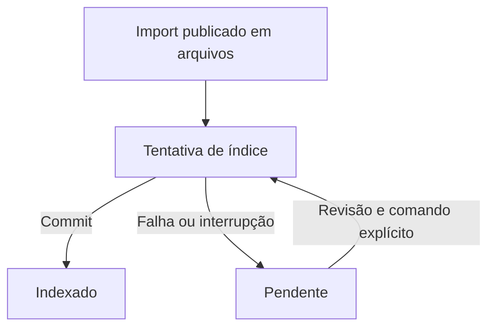

# API e índice PostgreSQL — v0.6.1

**CANDIDATE para LAB.** Este guia prepara uma qualificação futura; não exige
alterar o LAB que está executando o soak do scheduler.

## Ativação explícita

A API continua usando o importador offline canônico. Por padrão, o índice está
`off` e não há conexão PostgreSQL. A v0.6.1 mantém `/api/v1`, o contrato do bundle,
o recibo em arquivos e os modos localhost/mTLS; acrescenta indexação opcional.

Em uma **base isolada**, instale o driver e configure externamente
PGHOST/PGDATABASE/PGUSER/PGPORT, credenciais por PGPASSFILE e TLS remoto
verify-full, conforme o [guia PostgreSQL](../persistence/README.md). Com a conta de
migração, execute `python persistence/P01_PostgreSQL.py migrate` explicitamente.
Depois configure a conta indexadora sem UPDATE/DELETE/CREATE para o processo da API.
Não use a conta de migração para operação normal.

Exemplo localhost com índice já preparado:

```sh
python ingestion/P01_Ingestion_API.py serve --store-dir /caminho/store-lab --bind 127.0.0.1 --metadata-index postgres
```

No mTLS, acrescente `--metadata-index postgres` ao comando já homologado,
preservando os argumentos de CA/cert/key, bind, process e store. O TLS do PostgreSQL
é independente do TLS da API. Não coloque senha ou DSN no comando da API.

O processo inicia sem testar/migrar o banco. `/healthz` indica que a API está
operacional; não é prontidão do índice. A qualificação deve verificar o estado
retornado para um import sintético conhecido.

## Duas confirmações distintas



HTTP 201 `imported` ou 200 `already_imported` mantém o significado de import em
arquivos. Com opt-in, a resposta também contém:

```json
{"metadata_index":{"status":"indexed","integration_version":"0.6.1"}}
```

| metadata_index.status | Significado | Ação |
|---|---|---|
| indexed | Fonte verificada e metadados presentes | Prosseguir com consumidores do índice |
| already_indexed | Mesma projeção já gravada | Replay idempotente; não cria outro import |
| pending + database_failed | Import em arquivos preservado; tentativa DB falhou | Corrigir disponibilidade/permissões; reconciliar explicitamente |
| pending + reason=not_indexed | GET encontrou fonte válida sem linha no índice | Reconciliar um import revisado |
| review_required + error_code | Integridade, identidade, schema, configuração ou conflito | Investigar antes de qualquer nova tentativa |

Os códigos são fixos. Nenhuma exceção do driver, credencial ou caminho interno
entra no resultado de `metadata_index`. Um 2xx sozinho não prova que o índice está
pronto. O node portátil mantém sua confirmação de upload em arquivos; não passa
a depender automaticamente do estado PostgreSQL.

O GET do bundle, após a autorização existente por node, verifica fonte e índice,
mas não grava nem migra. Um GET com índice indisponível preserva o resumo do
recibo e indica pendência. IDs e metadados indexados precisam corresponder à fonte.

## Reconciliação de um import

Após corrigir a causa e revisar recibo/identidade, use a conta indexadora e os
caminhos reais do store e do import já publicado:

```sh
python persistence/P01_PostgreSQL.py index-import --store-dir /caminho/store-lab --import-dir /caminho/store-lab/assessments/LAB-001/imports/bnd-XXXXXXXXXXXXXXXXXXXX
python persistence/P01_PostgreSQL.py show-import --bundle-id bnd-XXXXXXXXXXXXXXXXXXXX
```

Substitua os placeholders pelos valores reais. `indexed`/`already_indexed`, exit 0;
falha com código fixo, exit 2. O comando é a reconciliação existente da fundação
v0.6.0 e não recolhe evidência nem faz upload. Nunca apague registros ou reescreva
recibos para resolver `bundle_conflict`. Se não existe import publicado completo,
o comando não fabrica um recibo ou reconstrói evidência a partir do banco.

Imports offline continuam independentes de PostgreSQL; podem ser indexados pelo
mesmo comando explícito. Não há sweep de diretórios, queue, retry, migração no
startup ou endpoint remoto para reconciliar caminhos arbitrários.

## Interrupções e limites

- Arquivos publicados, DB não commitado: a fonte preservada permite indexação explícita.
- DB commitado, resposta perdida: replay encontra `already_imported`/`already_indexed`.
- Falha durante insert: a transação DB é desfeita inteira; arquivos permanecem.
- Requests duplicados dentro da mesma API: staging é limpo sob o lock do bundle,
  antes que o request seguinte possa usar seu nome canônico.
- A fonte v0.6.0 admite IDs ASCII de 1..128 caracteres, iniciando por alfanumérico
  e contendo letras/números/ponto/underscore/hífen. Outros imports podem ser aceitos
  pelo pipeline anterior, mas exigirão revisão para esse índice candidato.

Os testes cobrem interrupção de processo nos pontos indicados, não perda de energia,
fsync/storage recovery, HA ou escritores de filesystem em vários processos.
Operar somente uma API escritora por store nesta qualificação. TLS/contas do LAB,
backup/restore, lifecycle completo, assets/findings e UI continuam pendentes.

[ADR 0012](ADR_0012_Ingestion_Index_v0.6.1.md) ·
[Status](STATUS_INGESTION_INDEX_v0.6.1.md)
